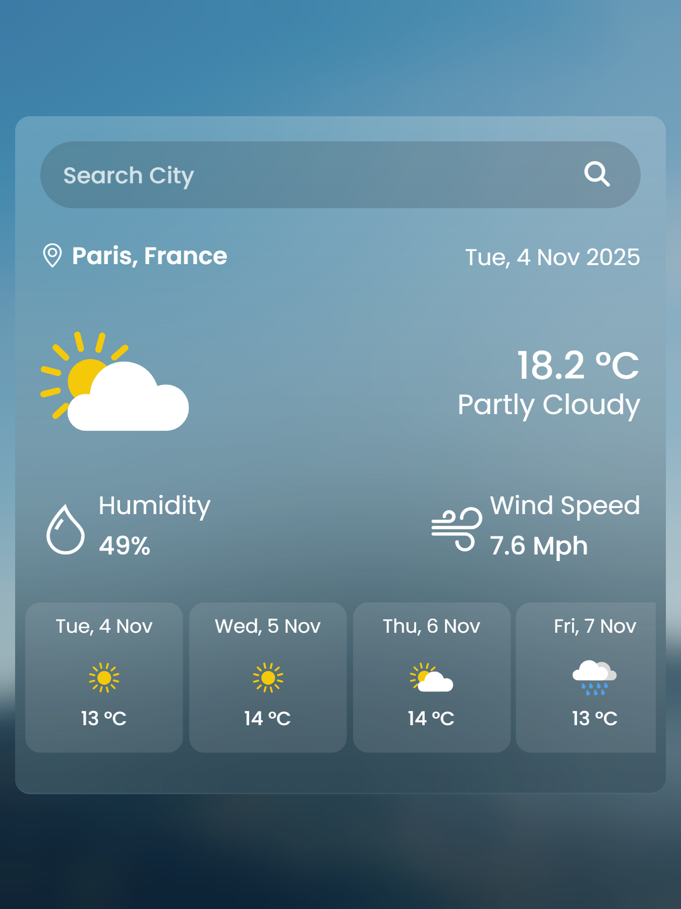
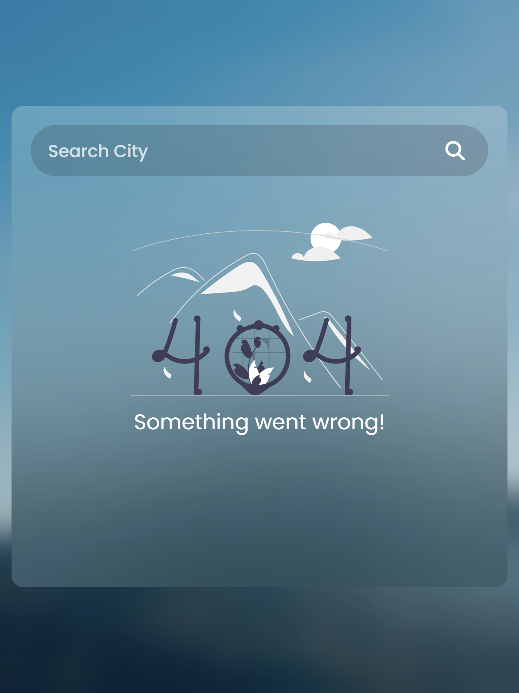

# 🌤️ Weather App

A sleek, responsive weather application that provides real-time weather conditions and forecasts for cities worldwide.

## 🚀 Live Demo

[View Live Demo](https://your-username.github.io/weather-app/)

## ✨ Features

- **🌡️ Real-time Weather Data** - Current temperature, humidity, and wind speed
- **🔍 City Search** - Search for weather in any city worldwide
- **📱 Responsive Design** - Works perfectly on desktop, tablet, and mobile
- **🎨 Beautiful UI** - Clean, modern interface with weather icons
- **⚡ Fast Loading** - Optimized for quick weather data retrieval
- **❌ Error Handling** - User-friendly error messages for invalid cities
- **🔄 Loading States** - Smooth loading animations during data fetch
- **🌤️ Weather Forecast** - Multi-day weather predictions

## 📸 Screenshots

  
  
  
   
  <em>Search Interface | Weather Display | Error Page</em>

## 🛠️ Technologies Used

### Frontend
- **HTML5** - Semantic markup and structure
- **CSS3** - Custom styles, animations, and responsive design
- **JavaScript ES6+** - Modern JavaScript with async/await
- **Bootstrap 5** - Responsive framework and components
- **Bootstrap Icons** - Beautiful icon library
- **Font Awesome** - Additional weather icons

### API & Data
- **WeatherAPI** - Real-time weather data provider

